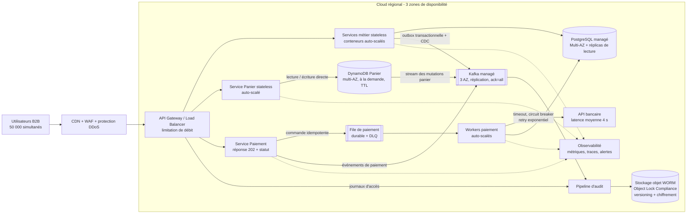

# Architecture technique — MegaShop-B2B

## Hypothèses et objectifs

- Déploiement dans une région cloud répartie sur trois zones de disponibilité ; le multi-région n'est pas exigé.
- Le SLO du panier est de **p95 < 50 ms côté API**, hors latence Internet du client.
- La cohérence doit être forte à l'échelle d'un panier. Une indisponibilité temporaire de la base relationnelle ne doit pas affecter sa consultation ni sa modification.
- L'historique porte sur toute action acceptée par la plateforme : accès, mutation métier, changement de panier et tentative de paiement. Les données sensibles de paiement sont masquées.

## Diagramme d'infrastructure

## Justification des choix

| Contrainte | Réponse architecturale | Bénéfice / compromis |
|---|---|---|
| 50 000 utilisateurs simultanés | CDN/WAF en frontal, services sans état sur conteneurs répartis sur 3 AZ, autoscaling sur débit, latence et profondeur des files | Absorbe les pics et limite le rayon d'impact ; demande des tests de charge et des quotas cloud préalloués. |
| Panier `< 50 ms` | DynamoDB dédié, accès direct par clé `tenantId + cartId`, capacité à la demande et aucune dépendance synchrone à PostgreSQL | Latence à un chiffre de millisecondes côté stockage et montée en charge horizontale ; impose une modélisation orientée accès et des limites de taille par panier. |
| Panier disponible sans base principale | Le panier a son propre stockage multi-AZ ; PostgreSQL n'est jamais sur son chemin critique | Une panne temporaire de PostgreSQL laisse le panier opérationnel ; prix d'une cohérence inter-domaines asynchrone. |
| Historique complet et inaltérable | Outbox PostgreSQL, Streams DynamoDB et journaux d'accès convergent vers Kafka répliqué, puis vers un stockage objet en mode WORM Compliance avec rétention légale | Pas de perte entre mutation et événement, conservation inviolable et rejouable ; stockage supplémentaire et gouvernance de rétention nécessaires. Toute mutation réglementée échoue fermée si sa traçabilité durable ne peut être garantie. |
| API bancaire à 4 s | Orchestration asynchrone : réponse `202 En traitement`, file durable, workers, clé d'idempotence, timeout, circuit breaker, retry exponentiel et DLQ | Aucun thread utilisateur bloqué pendant 4 s et absorption des ralentissements ; paiement à cohérence éventuelle, donc statut consultable et notification au client. |

Kafka est un tampon de transport, pas l'archive légale : seule la copie WORM chiffrée, versionnée et soumise à une politique de rétention constitue la preuve durable. Les identifiants de corrélation, numéros de séquence et empreintes cryptographiques permettent de détecter un manque ou une altération.

## Principaux points d'exploitation

- SLO à superviser : panier p95 `< 50 ms`, taux d'erreur, throttling DynamoDB, retard d'archivage d'audit, âge/profondeur de la file de paiement et taux d'ouverture du circuit bancaire.
- Sauvegardes avec restauration à un instant donné pour PostgreSQL et DynamoDB ; tests réguliers de restauration et de bascule AZ.
- Chiffrement en transit et au repos, secrets dans un coffre-fort, IAM au moindre privilège et segmentation réseau privée pour les données.
- Tests de charge à 50 000 sessions avec marge, tests de panne PostgreSQL, de perte d'une AZ et de ralentissement bancaire avant mise en production.
